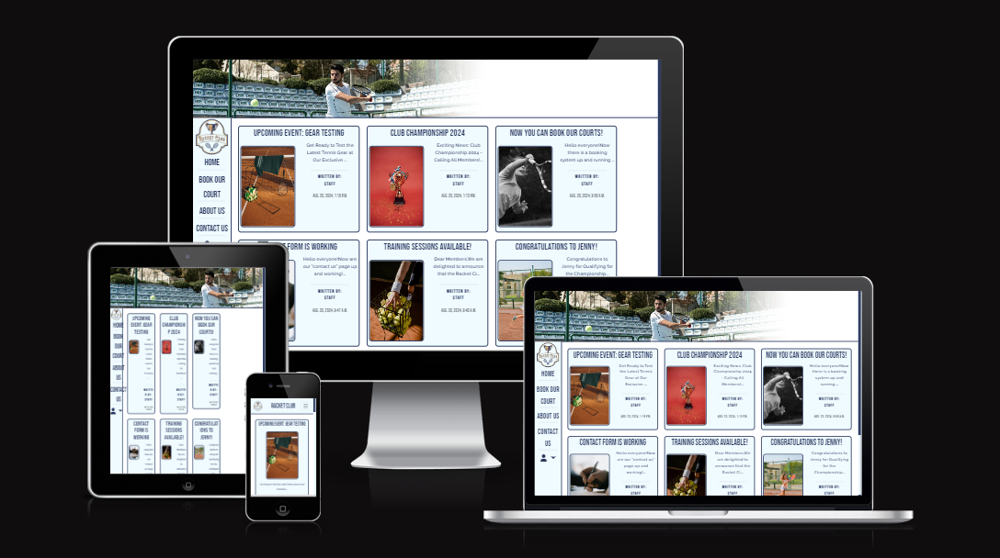
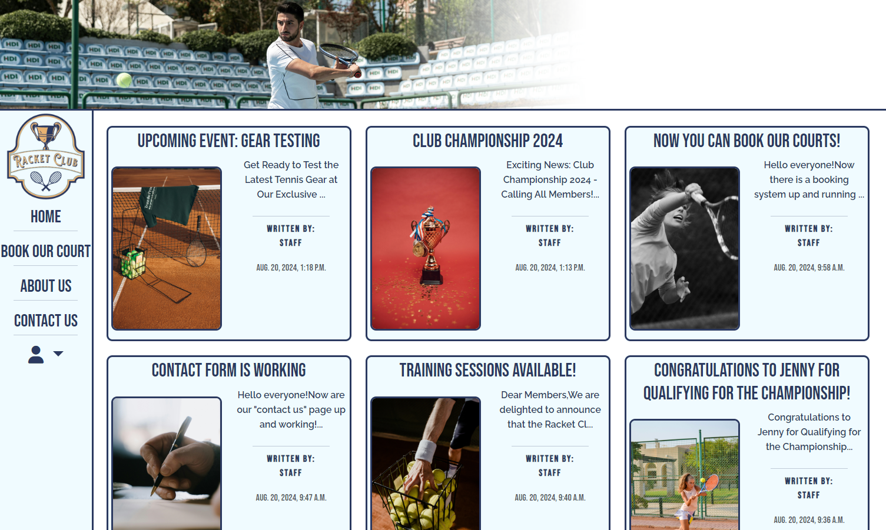
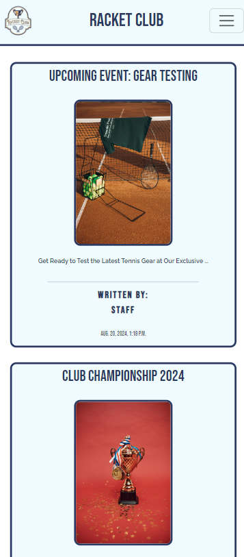
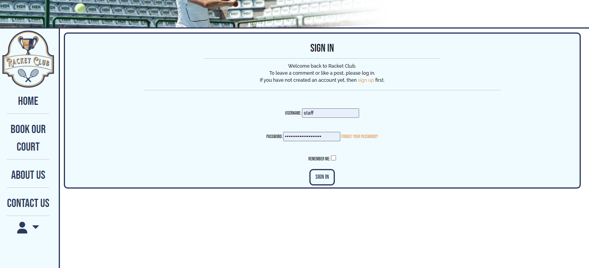
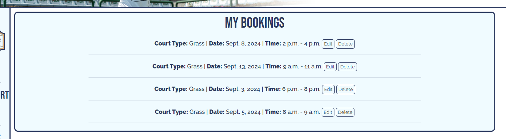

# Racket Club

**Live website:** https://racketclub-d78eaddb5d10.herokuapp.com/

<br><br>

This is a page about a fictional Racket club that have some tennis courts that everyone can book to play on.
The Club also have members that play semi-professional Tennis with great results.
As a visitor to this page you can register an account so that you can book a court and comment on articles.
There are also a contact form that users can send questions to the club.

# Content
- [Introduction](#racket-club)
- [Project planning](#project-planning)
    * [Database structure](#database-structure)
    * [Wireframes](#wireframes)
    * [User stories](#user-stories)
- [Content](#content)
    * [Home page](#home-page)
    * [Article page](#article-page)
    * [Rules page](#rules-page)
    * [Booking form](#booking-form)
    * [Booking success](#booking-success)
    * [Edit booking](#edit-booking)
    * [Delete booking](#delete-booking)
    * [About us page](#about-us-page)
    * [Contact us page](#contact-us-page)
    * [Error pages](#error-pages)
- [Design](#design)
    * [Logo](#logo)
    * [Colorscheme](#colorscheme)
    * [Fonts](#fonts)
- [Resources](#resources)
- [Technologies](#technologies)
    * [Languages used](#languages-used)
    * [Packages](#packages-installed)
- [Deployment](#deployment)
    * [Github](#github)
    * [Deploy in development environment](#deploy-in-development-environment)
    * [Heroku](#heroku)
- [Testing](#testing)
- [Problems encountered](#problems-encountered)
- [Credits](#credits)

# Project planning

## Database structure

### This is the structure I planned this project with
<br>
### And this is how it turned out:<br><br>
- For the "About us" and "Rules" page there´s only a TextField so that admins easily can change the content from the adminpanel.<br>
<br>
<br>
- The structure of the articles was created as planned.<br>
<br>
- The structure of the comments was also created as planned.<br>
<br>
- The structure of the booking database got a little bit more fields than I expected.<br>
- Since there are two types of courts that choice had to be done.<br>
- Tried to make a function to calculate start_time and end_time with some parameters, but that didn´t go as I wanted. Instead I fed the database with the start and endtimes for the booking system.
- When a user are booking a court the database stores: <br>- what courttype that has been booked<br>- what date the booking was made for<br>- start and endtime for the booking<br>- what user that made the booking

<hr>

- ### [Go back to the content list](#content)

## Wireframes

This was my vision on how this project would be visual for the user.
Worked after this model as much as I could for the basic structure.<br>

<br>
<br>
<br>

- ### [Go back to the content list](#content)

## User Stories

Here you can check out my user stories on the canban-board<br>
[Canban-board](https://github.com/users/Profess0ro/projects/6/views/1)

- ### [Go back to the content list](#content)

# Content

## Home page
<br><br>
When a user lands on the homepage on big screens, there are a header with a picture of a tennisplayer on the top of the page. A menu are shown to the left and a footer will be at the bottom of the page (not visual on the picture). In the content area of the homepage are articles shown for the user and if there are more than 6 articles written there will be a "Next >>" button visual to show the rest of the articles.<br>
<hr>
<br>
<br><br>
For user that goes to this page on smallest screens, the menu has gone up to the top of the page as a dropdown menu and all articles are now on top of eachother instead of three by three on the rows. The footer remains on the bottom of the page.

## Article page

When a user click on an article card, they will get into this view:<br><br>
<br><br>
First they will se the attached image, then the title and after that the author and when it was created. I´ve put the image on top because when a user wants to read the article it more suitable to have the image on top of the title so it doesn´t interrupting with a space between title and content.<br><br><br><br>
Further down on the article page there is a commenting function only available for the user that are signed in.<br>
For the user on smaller screens the image are smaller so it won´t take that much of space on the screen.<br>
<br><br>

## Rules page

<br><br>
When a user click on "Book our court" they are arriving on a page that displaying rules and general info about our court and how to gain access, pay for the booking and that there are equipment to borrow if they want that.
This page is available to all user, but if they click on "Book now" the next page (booking form) are only available to the user that are logged in.
<hr>
<br><br>
For user that are going to this page on smaller screens the image isn´t visual so that image doesn´t take up to much space for the user.

## Booking form
<br><br>
If a user trying to book a court without being signed in first they will get directed to the sign in page.<br><br>
<hr>
<br><br>
But if a user are signed in, they will be directed to the booking form. Here are the booking system explained for the user on how it works. Since the booking system only allows bookings to be booked maximum 14 days ahead. The function calculates and display only dates from today (22 august) and 14 days ahead. So the first choice a user has to do is to pick what type of court they want to play on, then a date they want to book.<br><br>
<br><br>
When a date are chosen, the system searching for booked times and calculates if there are any available times that date. Those times are then filled in the area for available times for the user. Now the user has to choose what time they want to play on. <br>


## Booking success

<br>
<br><br>
If all goes through with valid data input to the form the user will get directed to a page that confirms the booking. All data that was selected and who that made the booking will be visualised on this page. There are two buttons here if the user wants to make another booking or view their bookings.


## Edit booking
<br><br>
When a user wants to see their booking that they have made there is a menu that comes down if you click on the profile image in the main menu. Here are an option that´s named "my bookings"<br><br>
<br><br>
<br><br>
After the user has clicked on "my bookings" this view comes up and listing all of the bookings made by this specific user. Behind every booking there are options to either edit or delete a booking. If a user clicks on "Edit" the view below comes up.<br><br>
<br><br>
This view is similar to the booking form with a small change that it updates the current booking and as the button says "update booking" this will update and change the time of the booking that was chosen.<br><br>
<br><br>
As you can see here the booking that was chosen differ from the first images time/date info on the specific booking.

## Delete booking
<br>
If a user wants to delete a booking by pressing "Delete" in the list of their bookings, this view comes up and asking the user if they are sure if they want to delete the booking. Here are also a option for the user to cancel this deletion if they don´t want to delete that specific booking.


## About us page

<br><br>
This page shows the content of what has been written in the adminpanel. In this way it´s easier for the admins to update the content. On smaller screens the image has `display: none;` <br><br>
<br><br>

## Contact us page

<br><br>
When a user wants to contact about any questions to the club, this form comes up on the screen. There are 3 different subjects to choose from so that the recievers know what type of question it regards.<br>
Even here the image has `display: none;` on smaller screens<br><br>
<br><br>
If the form is successfully filled, the user will be directed to a page that confirms that the form has been filled in and the mail has been sent<br><br>


## Error pages

<br><br>
<br><br>
I have the same error page for the following errors:<br>- **403:** When a user doesn´t have the permission to go to that specific page.<br>- **404:** When a page doesn´t exist that the user was directed to.<br>- **500:** When the database doesn´t connect.<br>- **504:** Network issues with the server.

- ### [Go back to the content list](#content)

# Design

## Logo
This logo was created by me with [Kittl´s](https://www.kittl.com/) creator tool. Very user friendly site with templates that makes it easier to start creating.<br>
<br>
<hr> 

## Colorscheme


This is the colors I´ve chosen to use through the whole page, except for the black content text (#000000).<br>
**#2B3860**
This color are the darkest of them all and are used on the borders that divides the pages content such as the paginated list of articles and images. The color are also used on titles and links so they stand out as well.<br>
**#E8B272**
The usage of this color except from the logo is the hovering effect on links and social links at the footer.<br>
**#F0FBFF**
This is the background color of the navigation bars and the content divs. It´s not far from the white color (#FFFFFF) but enough difference so that it divides the comment entries from eachoter.<br> 
**#789EA7**
This color has a honorable mention since it´s only in the logo as a small line.<br>
**#FFFFFF**
This is the background color of the "main content" area and also background color of the uneven comment entries on articles.
<hr>

- ### [Go back to the content list](#content)

## Fonts
**[Raleway](https://fonts.google.com/specimen/Raleway?query=raleway)**
This font is in my opinion a very readable font, thats why I choosed to have that on the content texts.<br>
**[Bebas Neue](https://fonts.google.com/specimen/Bebas+Neue?query=Bebas+Neue)**
This font are used on titles, links and the author info on articles. The font catched my eye when I browsed through fonts and really looked nice as a title text.

- ### [Go back to the content list](#content)

# Resources

[Pexels](https://www.pexels.com) - Image library<br>
[Google Fonts](https://fonts.google.com/) - Font library<br>
[Font Awesome](https://www.fontawesome.com) - Icon library<br>
[Kittl](https://www.kittl.com/) - Logo creator<br>
[Neon](https://neon.tech/) - Database<br>
[Mailtrap](https://mailtrap.io/) - SMTP for the contactform<br>
[Cloudinary](https://cloudinary.com/) - Database storage for images

- ### [Go back to the content list](#content)

# Technologies

### **Languages used:** 
- Django
- Python
- HTML
- CSS
- JavaScript
 

### **Packages installed:**<br>
After every time `pip3 install <package>` are used, ensure to use `pip3 freeze --local > requirements.txt` 

- [cloudinary](https://pypi.org/project/cloudinary/)
- [crispy-bootstrap5](https://pypi.org/project/crispy-bootstrap5/)
- [dj-database-url](https://pypi.org/project/dj-database-url/)
- [dj3-cloudinary-storage](https://pypi.org/project/dj3-cloudinary-storage/)
- [django](https://pypi.org/project/Django/)
- [django-allauth](https://pypi.org/project/django-allauth/)
- [django-crispy-forms](https://pypi.org/project/django-crispy-forms/)
- [django-summernote](https://pypi.org/project/django-summernote/)
- [gunicorn](https://pypi.org/project/gunicorn/)
- [psycopg2-binary](https://pypi.org/project/psycopg2-binary/)
- [whitenoise](https://pypi.org/project/whitenoise/)
- [python-dateutil](https://pypi.org/project/python-dateutil/)

- ### [Go back to the content list](#content)

# Deployment

### GitHub
1. Log in to your GitHub account.
2. Create a repository by click on 'New' at the repositories page.
3. Go into your repository [This repository](https://github.com/Profess0ro/Racket_club) and click on 'Code' and copy the link.
4. Open VS code and choose 'Clone git repository..' now paste the link in the command file at the top: `https://github.com/Profess0ro/Racket_club.git` and choose a local storage in the window that pops up.

### Deploy in development environment

1. Open your repository `https://github.com/Profess0ro/Racket_club.git` with your choice of workspace (VS code or GitPod)
2. Install required dependencies with 
	```
	pip3 -r requirements.txt.
	```
3. Create `env.py` and make sure to add that file to your `.gitignore`. In `env.py` you are going to store some sensitive information.
4. Add the following info to `env.py`: <br>
    `CLOUDINARY_URL`<br>`DATABASE_URL`<br>`SECRET_KEY`
5. In your `settings.py` add your workspace URL to `ALLOWED_HOSTS`.
6. Start your project by writing this in the terminal:
```
django-admin startproject <projectname>
```
This will create following tree in your repository:
```
<projectname>/
    manage.py
    <projectname>/
        __init__.py
        settings.py
        urls.py
        asgi.py
        wsgi.py
```
7. Create apps by writing this in the terminal:
```
python3 manage.py startapp <appname>
```
This will create following tree:
```
<appname>/
    __init__.py
    admin.py
    apps.py
    migrations/
        __init__.py
    models.py
    tests.py
    views.py
```
8. Everytime you´ve created an app and added models to each `models.py` make sure to make migrations with the following steps for adding to the database:
```
python3 manage.py makemigrations
```
```
python3 manage.py migrate
```
9. Create a superuser so that you have access to the adminpanel:
```
python3 manage.py createsuperuser
```
10. To preview the project type in:
```
python3 manage.py runserver
```
11. Before deploying to production:<br>
- Type in:
```
pip3 freeze > requirements.txt
``` 
- Make sure that in the `settings.py` you have: `DEBUG=False` 
12. Commit and push to GitHub.

- ### [Go back to the content list](#content)

### Heroku
1. Log in to your Heroku account
2. Go to the **'Heroku dashboard'** and click **'New'** and then **'Create new app'**
3. Choose a unique name for this application, then choose region (EU or USA)
4. Now go to **'Settings'** -> **'Reaveal config vars'** and add **'KEY'** and add following keys with the right value from your `env.py`:
- `CLOUDINARY_URL`
- `DATABASE_URL`
- `SECRET_KEY`
- `PORT` (value: 8000, can be found in settings.py)
5. In **'Settings'** click on **'Add buildpack'** and add following pack: `Python`
6. To install requirements use `pip install -r requirements.txt` at the terminal in VS Code/GitPod.
7. To create the Procfile use `echo web: node index.js > Procfile` at the terminal in VS Code/GitPod.
8. To deploy your repository to your Heroku account there are two ways. First go to **'Deploy'** in your Heroku application then scroll down and choose one of these options:<br>- **'Enable Automatic Deploys':** If you want that everytime you use `git push` in VS Code/GitPod that it deploys to Heroku<br>- **'Deploy Branch':** If you want to manually deploy your changes and have control when the code should or shouldn´t been deployed.

# Testing

I´ve made an external markdown file for testing and validation. <br>This file can be found [here](TESTING.md).

- ### [Go back to the content list](#content)

# Problems encountered

<br><br>
- Suddenly the database didn´t cooperate with the page and started to search for other columns.<br>
**Solution:**<br>
Deleted and created a new database and migrated my models. Then the page found the right columns and content without changing anything of the codes.<hr>


- When trying to edit a comment on an article nothing happened when I pressed the button. No content appeared in the commentform to edit.<br>
**Solution:**<br>
Noticed that the `comments.js` searched for the wrong classnames and that´s why nothing happened. Changed name in `document.getElementsByClassName("")` and all worked again.<hr>

- When I created "About us" and was going to preview how the content was shown after installing the `SummernoteModelAdmin` I saw that all codetags was visual.<br>**Solution:**<br>
Adding `|safe` after, so that the code looks like this in the html-file: `{{ content.content|safe }}`<hr>

- Noticed after I´ve created the modal for deleting a comment this error occured:<br>
`modal.js:158 Uncaught TypeError: Cannot read properties of undefined (reading 'backdrop')
    at ne._initializeBackDrop (modal.js:158:39)
    at new ne (modal.js:69:27)
    at HTMLDocument.<anonymous> (comments.js:14:23)`<br>
Since `comments.js` are loaded into `base.html` it kept searching for the modal named `deleteModal` in every extended html-file. With this error it also blocked users from logging in.<br>
**Solution:**<br>
`const deleteModalElement = document.getElementById("deleteModal");
    let deleteModal = null;
    if (deleteModalElement) {
        deleteModal = new bootstrap.Modal(deleteModalElement);
    }` was added into `comments.js` so if the html-file doesn´t have a modal with the name `deleteModal` it doesnt initialize the modal element.<hr>

- Problems generating available times.
The final app for booking is my 4th try to make a booking system. On the first 3 times I´ve tried to give a function the span of starting and end times that it should calculate with. But after the 3rd try I came up with a solution to feed the database with start and end times that a function could calculate with. That really solved my problem with the booking system that now easier can calculate available times for the users.<br><hr>

- Responsiveness on tablets.<br><br>

Saw that if a user a tablet vertically there will be a problem with the article posts.<br>
<br>
**Solution:**<br>
If the user instead rotates the tablet and use it horizontally it looks better.<br>
<br>
<hr>

- When listing my bookings the list included times that had expired.<br>
**Solution:** <br>
`from django.utils.timezone import now` imported now and used that to filter the bookings made with this code : <br>
`today = now().date()`<br>`
    bookings = Booking.objects.filter(booked_by=request.user, date__gte=today)`<br>
So that bookings from yesterday and earlier are excluded in the list.

- ### [Go back to the content list](#content)

# Credits

- [Mailtrap tutorial to create contactform](https://www.youtube.com/watch?v=5XFiqc8HlkE)
- Rohit Sharma - My mentor, for great meetings and helpful tips

