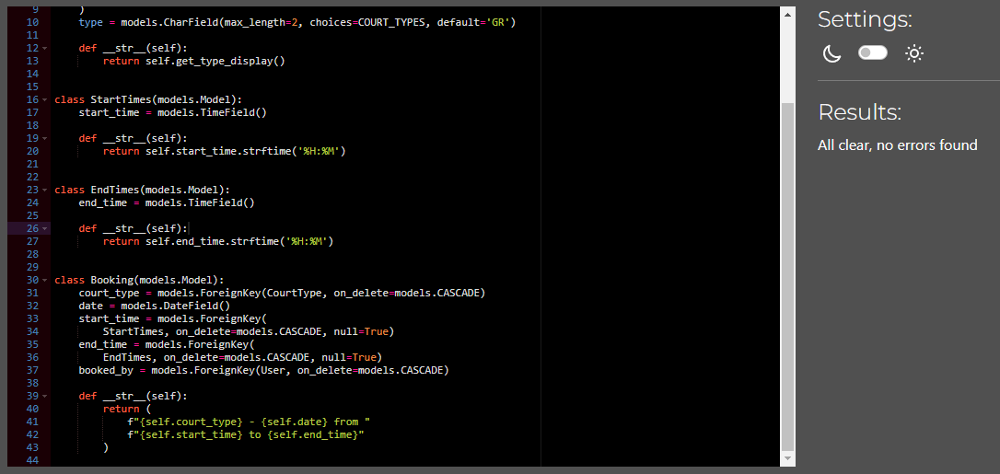

[Validation](#validation)
*   [CSS and JS](#css-and-js)
*   [HTML files](#html-files)
*   [Python files](#python-files)

[Manual testing](#manual-testing) 
[Resources](#resources)

# Validation

### CSS and JS

CSS File

 

When I ran the css code in W3C css validator, it didn´t find anything that was wrong.

Javascript files

 
<b>booking.js:</b> 
 
Since the js-file are loaded into the base.html the jshint found a problem that the functions are after the if statement where it searches for elements that starts the functions to operate.  
<b>comments.js:</b> 
 
Since the code for bootstrap modal 'deleteModal' are in the article_detail.html there seems to be a confusing problem for the jshint.

### HTML files

Screenshot results for all templates

 
<h2>Start page</h2> 
 
<h2>Random article</h2>
 
<h2>Rules page</h2>
 
<h2>Booking form</h2>
 
<h2>Successful booking</h2>
 
<h2>About us page</h2>
 
<h2>Contact us page</h2>
 
<h2>Contact us success page</h2>
 
<h2>Log out profile page</h2>
 
<h2>Sign up page</h2>
 
Here it seems to be some error with the generated tags in signup.html
Can´t find where I can change this and as shown in the image below, all elements seems to be there.
 
<h2>Log in profile page</h2>
 
<h2>My bookings page</h2>
 
<h2>Edit booking page</h2>
 
<h2>Delete booking page</h2>
 

### Python files
Screenshots from CI Python Linter validation

Projects .py-files

 
<h2>settings.py</h2>
 
<h2>urls.py</h2>
 

About us app

 
<h2>admin.py</h2>
 
<h2>models.py</h2>
 
<h2>urls.py</h2>
 
<h2>views.py</h2>
 

Articles app

 
<h2>admin.py</h2>
 
<h2>forms.py</h2>
 
<h2>models.py</h2>
 
<h2>urls.py</h2>
 
<h2>views.py</h2>
 

Bookings app

 
<h2>admin.py</h2>
 
<h2>models.py</h2>
 
<h2>urls.py</h2>
 
<h2>views.py</h2>
 

Contact app

 
<h2>forms.py</h2>
 
<h2>views.py</h2>
 

# Manual testing

### Home page
| Feature | Expected Outcome | Testing Performed | Result | Pass/Fail |
| --- | --- | --- | --- | --- |
| Navigate to the booking system | When clicking on "Book our court" a page with the rules will show | Clicked on "Book our court" | A page with rules and a button with "Book Now" was shown | Pass |
| Navigate to About us | When clicking on "About us" a page with the information about the club will show | Clicked on "About us" | A page with information about the club was shown | Pass |
| Navigate to the contact form | When clicking on "Contact us" a page with a contact form will show | Clicked on "Contact us" | A page with a contact form was shown | Pass |
| Navigate to an article by clicking on a image | When clicking on an image in a article card, that specific article will show | Clicked on an image within an article card | That specific article was shown | Pass |
| Navigate to an article by clicking on a title | When clicking on a title in a article card, that specific article will show | Clicked on a title within an article card | That specific article was shown | Pass |
| Navigate to an article by clicking on a slice text | When clicking on a slice text in a article card, that specific article will show | Clicked on a slice text within an article card | That specific article was shown | Pass |
| See more articles by clicking on the "Next"-button | When clicking on the "Next"-button, more articles will be shown | Clicked on the "Next"-button | More articles was shown | Pass |
| See more articles by clicking on the "Prev"-button | When clicking on the "Prev"-button, articles on the previous page will be shown | Clicked on the "Prev"-button | The previous article page was shown | Pass |
| Navigate to the sign up form | When clicking on "Signup" in the profile menu, a sign up form to create a user will be shown | Clicked on "Signup" in the profile menu | A sign up form to create a user was shown | Pass |
| Navigate to the log in page | When clicking on "Login" in the profile menu, a login page will be shown | Clicked on "Login" in the profile menu | A login page was shown | Pass |

# Resources
[W3C css validator](https://jigsaw.w3.org/css-validator/validator) 
[JShint](https://jshint.com/) 
[CI Python Linter](https://pep8ci.herokuapp.com/)