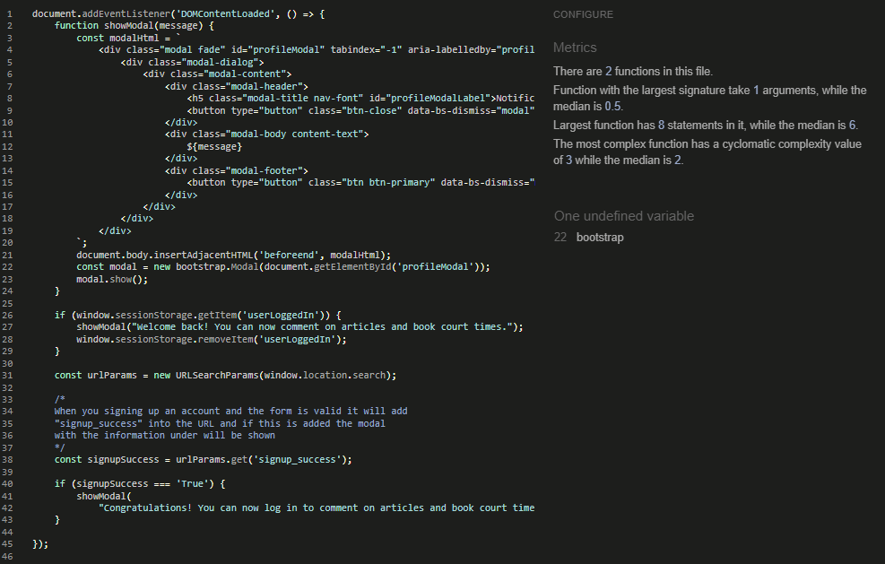

- [Validation](#validation)
    * [CSS and JS](#css-and-js)
    * [HTML files](#html-files)
    * [Python files](#python-files)
- [Performance](#performance)
- [Manual testing](#manual-testing)
    * [Home page](#home-page)
    * [Booking system](#booking-system)
    * [Commenting an article](#commenting-an-article)
    * [Sign up / Sign in / Sign out](#sign-up--sign-in--sign-out)
    * [Links in the menus](#links-in-the-menus)
- [Resources](#resources)

# Validation

### CSS and JS

CSS File

 

When I ran the css code in W3C css validator, it didn´t find anything that was wrong.

Javascript files

 
<b>booking.js:</b> 
 
Since the js-file are loaded into the base.html the jshint found a problem that the functions are after the if statement where it searches for elements that starts the functions to operate.  
<b>comments.js:</b> 
 
Bootstrap modal function is the only thing it found. 
<b>profile.js:</b> 
 
Bootstrap modal function is the only thing it found. 

### HTML files

Screenshot results for all templates

 
<h2>Start page</h2> 
 
<h2>Random article</h2>
 
<h2>Rules page</h2>
 
<h2>Booking form</h2>
 
<h2>Successful booking</h2>
 
<h2>About us page</h2>
 
<h2>Contact us page</h2>
 
<h2>Contact us success page</h2>
 
<h2>Log out profile page</h2>
 
<h2>Sign up page</h2>
 
Here it seems to be some error with the generated tags in signup.html
Can´t find where I can change this and as shown in the image below, all elements seems to be there.
 
<h2>Log in profile page</h2>
 
<h2>My bookings page</h2>
 
<h2>Edit booking page</h2>
 
<h2>Delete booking page</h2>
 

### Python files
Screenshots from CI Python Linter validation

Projects .py-files

 
<h2>settings.py</h2>
 
<h2>urls.py</h2>
 

About us app

 
<h2>admin.py</h2>
 
<h2>models.py</h2>
 
<h2>urls.py</h2>
 
<h2>views.py</h2>
 

Articles app

 
<h2>admin.py</h2>
 
<h2>forms.py</h2>
 
<h2>models.py</h2>
 
<h2>urls.py</h2>
 
<h2>views.py</h2>
 

Bookings app

 
<h2>admin.py</h2>
 
<h2>models.py</h2>
 
<h2>urls.py</h2>
 
<h2>views.py</h2>
 

Contact app

 
<h2>forms.py</h2>
 
<h2>views.py</h2>
 

# Performance 

### Lighthouse
  
The result wants me to use article images with the right size. These card-images on the homepage are downsized from 675px height to 279px height, since the code takes original cloudinary-uploaded image and transform it to the card-size. 
It also wants me to not load unnecessary css/js files, all these files are loaded in to base.html so that they are in a "standby-mode" until they are needed. The js-files have a if statement to search for an element before loaded and working at the pages.
Those are the biggest issues the result came up to.

# Manual testing

### Home page

Manual test on home page

 

| Feature | Expected Outcome | Testing Performed | Result | Pass/Fail |
| --- | --- | --- | --- | --- |
| Navigate to the booking system | When clicking on "Book our court" a page with the rules will show | Clicked on "Book our court" | A page with rules and a button with "Book Now" was shown | Pass |
| Navigate to About us | When clicking on "About us" a page with the information about the club will show | Clicked on "About us" | A page with information about the club was shown | Pass |
| Navigate to the contact form | When clicking on "Contact us" a page with a contact form will show | Clicked on "Contact us" | A page with a contact form was shown | Pass |
| Navigate to an article by clicking on a image | When clicking on an image in a article card, that specific article will show | Clicked on an image within an article card | That specific article was shown | Pass |
| Navigate to an article by clicking on a title | When clicking on a title in a article card, that specific article will show | Clicked on a title within an article card | That specific article was shown | Pass |
| Navigate to an article by clicking on a slice text | When clicking on a slice text in a article card, that specific article will show | Clicked on a slice text within an article card | That specific article was shown | Pass |
| See more articles by clicking on the "Next"-button | When clicking on the "Next"-button, more articles will be shown | Clicked on the "Next"-button | More articles was shown | Pass |
| See more articles by clicking on the "Prev"-button | When clicking on the "Prev"-button, articles on the previous page will be shown | Clicked on the "Prev"-button | The previous article page was shown | Pass |
| Navigate to the sign up form | When clicking on "Signup" in the profile menu, a sign up form to create a user will be shown | Clicked on "Signup" in the profile menu | A sign up form to create a user was shown | Pass |
| Navigate to the log in page | When clicking on "Login" in the profile menu, a login page will be shown | Clicked on "Login" in the profile menu | A login page was shown | Pass |

### Booking system

Manual test on the booking system

 

| Feature | Expected Outcome | Testing Performed | Result | Pass/Fail |
| --- | --- | --- | --- | --- |
| Can´t book a time when not logged in | When not logged in, a text will tell the user to login before they can book | Went to the rules page before logged in | A text told me to login before booking a time | Pass |
| "Book now" button shown | When logged in at the rules a button with the text "Book now" should be visual | Logged in and went to the rules page | A button with the text "Book now" was shown | Pass |
| No timeslots that have been past can be booked | Now when the time is 11:47 AM no times with starttime before 12.00 PM should be visual when selecting todays date | Selected todays date | The first time available was 12:00 PM - 01:00 PM | Pass |
| Successfully book a time | Select a date and time to play on and click "Book now". Then be navigated to a confirmation page | Selected a date and time and clicked "Book now" | Was navigated to a page confirming the booking with booking info. | Pass |
| No booked times are available | When booking a time, there should not be booked times visual for other users | Since there was a time booked in the previous test on todays test between 03:00 - 05:00 PM on grass court, there should not be any times visual within this span. | Selected todays date and no starting times between 03:00 - 05:00 PM was shown, but if you choosed the gravel court there was times available within that timeslot. | Pass |

### Commenting an article

Manual test on the commenting system on an article

 

| Feature | Expected Outcome | Testing Performed | Result | Pass/Fail |
| --- | --- | --- | --- | --- |
| Can´t comment on an article when not logged in | When not logged in, a text will tell the user to login before they can comment | Scrolled down in an article to the comment section without logged in before | There was a text telling me to log in before commenting | Pass |
| Comment textarea visual | When logged in there will be information about who is commenting and a textarea visual to comment the article | Logged in and scrolled down to the commenting section | The comment section told me who was logged in, that the comment will be reviewed and a textarea to comment | Pass |
| Try to comment with empty textarea | When submitting an empty textarea, there will be a message telling to fill in the textarea | Pressed "Submit" with an empty textarea | There was a message telling me that the textarea can´t be empty | Pass |
| Confirmation when posted a comment | When clicking on the "Submit"-button a message shall confirm the post | Posting a comment by clicking "Submit" | A message shown up when the page has been reloaded, that my comment has been confirmed but waiting approval | Pass |
| "Edit/delete"-buttons beside my own comments only | "Edit/delete"-buttons shall only be visual on my own comments and not other users comments | Scrolled down to the comment section where two different users had comment | Only on my own comment there was "edit/delete"-buttons visual | Pass |
| Edit a comment | When clicking on "Edit" the comment will jump back to the textarea and the "submit"-button change text to "update". Clicking on the "update"-button will update the comment | Clicked on the "edit"-button next to my comment | My comments content jumped back to the textarea and the "submit"-button changed to "update". Changed the content and pressed "update", the page reloaded and the comment was updated | Pass |
| Delete a comment | Clicking on the "delete"-button will open up a modal asking the user if they are sure to delete the comment | Clicked the "delete"-button next to my comment | A modal was asking me if I wanted to delete the comment that was chosen. When confirming the delete, comment was deleted | Pass | 

### Sign up / Sign in / Sign out

Manual test on the account pages

 

| Feature | Expected Outcome | Testing Performed | Result | Pass/Fail |
| --- | --- | --- | --- | --- |
| Fill in form with invalid when signing up | When signing up for an account with invalid form data there will be a message telling the user what need to be corrected | Tried to create an account with 1 character in the password | Message told me that the password is to short and only numeric | Pass |
| Signing up with valid data | When signing up for an account successfully, there will be a modal telling the user that they now can comment and book times | Created an account with valid data | Modal congratulated me on creating an account and told me that I can now comment and book times | Pass |
| Sign in with invalid account data | When signing in with invalid data, there will be a message telling the user what´s wrong. | Trying to log in with invalid data | A message told me that the username or password was not correct | Pass |
| Sign in with valid data | When signing in with valid data, the user will have a modal showing up telling them that they now can comment and book times | Signed in with valid data and a modal showed me that I now can comment and book times | Pass |
| Signing out | When clicking on "Sign out" you will be directed to a page asking the user if they are sure to sign out. When sure to sign out the account will log out | Clicked on "Sign out" and then confirming the sign out | First I was directed to a page asking me if I´m sure to Sign out, then I was signed out when confirming | Pass | 

### Links in the menus

Manual test on the menus for big and small screens

 
<strong>These tests are made on both small and big screens.</Strong>

| Feature | Expected Outcome | Testing Performed | Result | Pass/Fail |
| --- | --- | --- | --- | --- |
| Directed to Home page | Directed to the Home page when clicking on "Home" or the logo | Clicked on "Home" and logo | Was directed to the Home page when both clicking on "Home" and the logo | Pass |
| Directed to Rules page | Directed to the rules when clicking on "Book our courts" | Clicked on "Book our courts" | Was directed to the rules page | Pass |
| Directed to about us page | Directed to about us page when clicking on "About us" | Clicked on "About us" | Was directed to the about us page | Pass |
| Directed to the contact form | Directed to the contact form when clicking on "contact us" | Clicked on "Contact us" | Was directed to the contact form | Pass |
| Directed to sign up form | Directed to the sign up form when clicking on "Sign up" | Clicked on "Sign up" | Was directed to the sign up form | Pass |
| Directed to sign in page | Directed to sign in page when clicking on "Sign in" | Clicked on "Sign in" | Was directed to the sign in page | Pass |
| Directed to Sign out page | Directed to the sign out page when clicking on "Sign out" | Clicked on "Sign out" | Was directed to sign out page | Pass |
| Directed to My bookings | Directed to the page with my bookings when clicking on "My bookings" | Clicked on "My bookings" | Was directed to the page listing my bookings | Pass |

### 404 Error

Manually forcing 404 Error

 

| Feature | Expected Outcome | Testing Performed | Result | Pass/Fail |
| --- | --- | --- | --- | --- |
| 404 page shown | When typing in an URL that doesn´t exists, the 404 page will be shown telling the user that something went wrong | Typed in an URL that doesn´t exist | A 404 page told me that something went wrong and that I could go back to the homepage or to the contact form | Pass |
| Testing the links on the error pages | When clicking on the links at the bottom of the errorpage, you will be correctly directed | Clicked on the links at the bottom of the errorpage | Got directed correctly to the homepage and the contact form | Pass |

 

# Resources
[W3C css validator](https://jigsaw.w3.org/css-validator/#validate_by_input) - Validating CSS file 
[JShint](https://jshint.com/) - Validate JS file 
[CI Python Linter](https://pep8ci.herokuapp.com/) - Validate python files